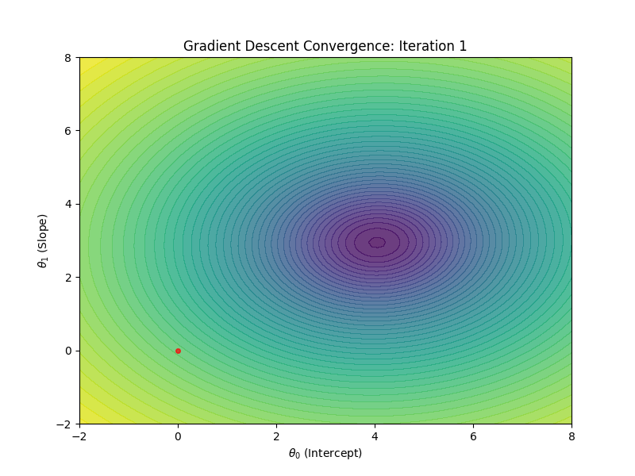
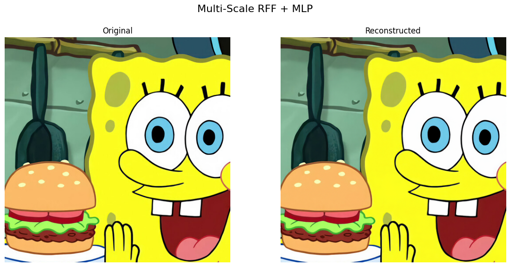
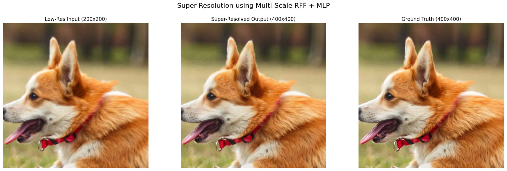
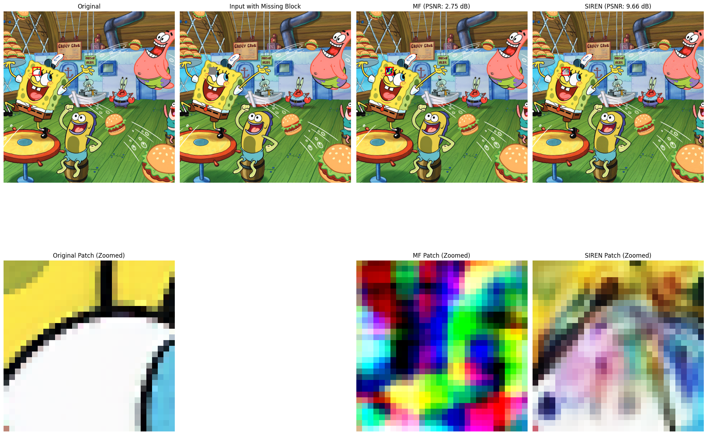
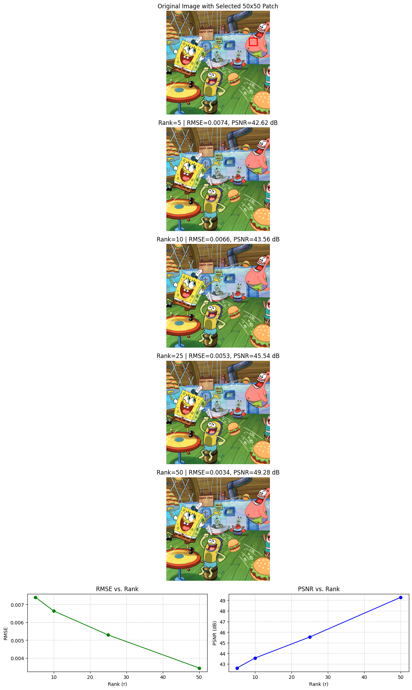

# signal-synth-ml: Signal Synthesis with Implicit Neural Representations and Matrix Factorization

This repository provides a comprehensive exploration of modern and classical techniques for signal synthesis, reconstruction, and compression. It serves as a practical, hands-on guide to representing complex signals like images and audio not as discrete grids of values, but as continuous functions learned by neural networks and other optimization methods.

The project systematically investigates, benchmarks, and visualizes the performance of several key algorithms, including:
- **Implicit Neural Representations (INRs):** Using coordinate-based networks like **SIRENs** to learn high-frequency details.
- **Random Fourier Features (RFFs):** As a powerful feature engineering technique to enable simple models to learn complex signals.
- **Matrix Factorization:** Leveraging low-rank assumptions for tasks like inpainting and compression, with a robust **Iterative SVD** implementation.

---

## Visual Showcase & Key Results

### Task 1: Gradient Descent Visualization

Visual comparison of different gradient descent optimizers navigating a loss landscape. Momentum-based methods consistently converge faster and more smoothly.

| Batch Gradient Descent | Stochastic Gradient Descent (SGD) | Mini-Batch Gradient Descent |
| :--------------------: | :-------------------------------: | :-------------------------: |
|  |  |  |
| **With Momentum** | **With Momentum** | **With Momentum** |
|  |  |  |

---

### Task 2: High-Fidelity Signal Reconstruction

Using a coordinate-based `SignalMLP` with multi-scale Random Fourier Features to reconstruct an image and an audio clip from their coordinates.

#### Image Reconstruction (PSNR: >28 dB)


#### Audio Reconstruction (SNR: >18 dB)
**Original Audio:**
<audio controls src="https://raw.githubusercontent.com/devansh-lodha/signal-synth-ml/main/data/audio/borgir.wav"></audio>

**Reconstructed Audio:**
<audio controls src="https://raw.githubusercontent.com/devansh-lodha/signal-synth-ml/main/results/task2/rff_mlp_audio_recon.wav"></audio>

---

### Task 3: 2x Super-Resolution with SIRENs

Training a state-of-the-art **SIREN** model on a `200x200` low-resolution image and using it to infer a sharp `400x400` high-resolution output, demonstrating the model's ability to generate high-frequency details.



---

### Task 4: Image Inpainting - MF vs. SIREN

A head-to-head comparison of inpainting a missing block. **Iterative SVD** provides a coherent low-rank completion, while **SIREN** excels at hallucinating plausible high-frequency textures.



---

### Task 5: Image Compression with Matrix Factorization

Using Matrix Factorization to compress a `50x50` image patch by finding low-rank approximations. The plot shows the trade-off between the compression ratio (controlled by `rank`) and reconstruction quality (PSNR).



---

## Repository Structure

The project is organized into a clean, modular structure for easy navigation and reuse.

```
signal-synth-ml/
├── data/                 # Input images and audio files
├── notebooks/            # Jupyter notebooks for each task, serving as the main reports
├── results/              # Output directory for generated plots, GIFs, and audio
├── src/                  # Core Python modules with reusable code
│   ├── data_loader.py    # Functions for loading and preprocessing data
│   ├── models.py         # Definitions for SIREN, MLP, etc.
│   ├── training.py       # Training loops for MF, SVD, and INRs
│   ├── utils.py          # Helper functions (coordinate maps, RFFs, metrics)
│   └── visualize.py      # Plotting and visualization functions
├── README.md             # This file
└── requirements.txt      # Project dependencies
```

---

## Setup and Usage

### 1. Clone the Repository
```bash
git clone https://github.com/devansh-lodha/signal-synth-ml.git
cd signal-synth-ml
```

### 2. Create a Virtual Environment (Recommended)
```bash
python3 -m venv venv
source venv/bin/activate  # On Windows, use `venv\Scripts\activate`
```

### 3. Install Dependencies
All required libraries are listed in `requirements.txt`.
```bash
pip install -r requirements.txt
```

### 4. Run the Notebooks
Navigate to the `notebooks/` directory and launch Jupyter Lab or Jupyter Notebook to run the experiments for each task.
```bash
cd notebooks
jupyter lab
```

---

## Technical Deep Dive & Key Learnings

This project served as a deep dive into the practical challenges and solutions in signal representation. Key insights include:

1.  **The Failure of Naive Matrix Factorization:** An initial attempt to use simple gradient descent for matrix completion failed catastrophically when a large portion of data was missing. The ill-posed nature of the problem led to exploding weights and a noisy output. This was solved by replacing the algorithm with **Iterative SVD Imputation**, a more robust method that is guaranteed to converge to a meaningful low-rank solution.

2.  **Overcoming Spectral Bias with SIRENs:** Early attempts at super-resolution using a standard MLP with RFFs resulted in blurry images. This is a classic example of **spectral bias**, where standard activation functions (like ReLU or GELU) are inherently poor at learning high-frequency functions. This was solved by deploying a **SIREN (Sinusoidal Representation Network)**, which uses a sine activation function, enabling the model to capture the sharp edges and fine textures required for high-fidelity reconstruction.

3.  **Inductive Biases of Different Models:** The inpainting showdown in Task 4 clearly illustrates the different "assumptions" or **inductive biases** of the models.
    *   **Matrix Factorization** assumes the image has a global low-rank structure, resulting in a smooth, coherent reconstruction that can sometimes appear blurry.
    *   **SIREN** has a bias towards smoothness in a local, differential sense, allowing it to generate plausible high-frequency details, though it can sometimes introduce subtle wave-like artifacts.

---

### Acknowledgements
This project was developed as part of coursework for an advanced machine learning course, guided by Prof. Nipun Batra. The explorations were inspired by foundational papers in the field of implicit neural representations and matrix completion.
